# AZ204 Training
Azure Developer Training

## Azure Functions
- Azure Functions lets you develop serverless applications on Microsoft Azure. You can write just the code you need for the problem at hand, without worrying about a whole application or the infrastructure to run it.
- We often build systems to react to a series of critical events. Whether you're building a web API, responding to database changes, processing IoT data streams, or even managing message queues - every application needs a way to run some code as these events occur.

### Azure Functions vs Logic Apps
- Azure Functions supports triggers, which are ways to start execution of your code, and bindings, which are ways to simplify coding for input and output data. There are other integration and automation services in Azure and they all can solve integration problems and automate business processes. They can all define input, actions, conditions, and output.
- Both Functions and Logic Apps are Azure Services that enable serverless workloads. Azure Functions is a serverless compute service, whereas Azure Logic Apps is a serverless workflow integration platform. Both can create complex orchestrations. An orchestration is a collection of functions or steps, called actions in Logic Apps, that are executed to accomplish a complex task.
- 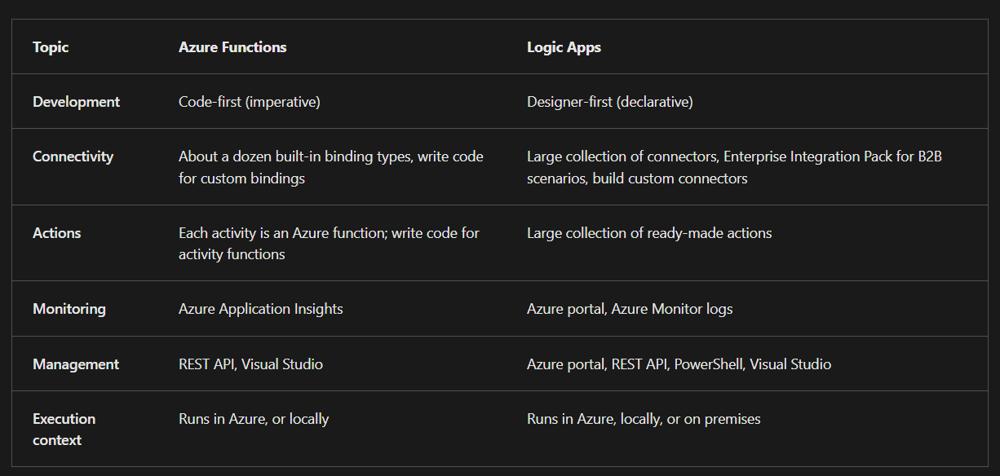

### Azure Functions vs WebJobs
- Like Azure Functions, Azure App Service WebJobs with the WebJobs SDK is a code-first integration service that is designed for developers. Both are built on Azure App Service and support features such as source control integration, authentication, and monitoring with Application Insights integration.
- Azure Functions is built on the WebJobs SDK, so it shares many of the same event triggers and connections to other Azure services.
- 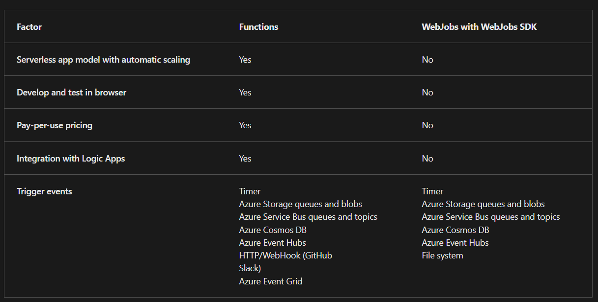
- Azure Functions offers more developer productivity than Azure App Service WebJobs does. It also offers more options for programming languages, development environments, Azure service integration, and pricing. For most scenarios, it's the best choice.

### Azure Functions Hosting Options
- 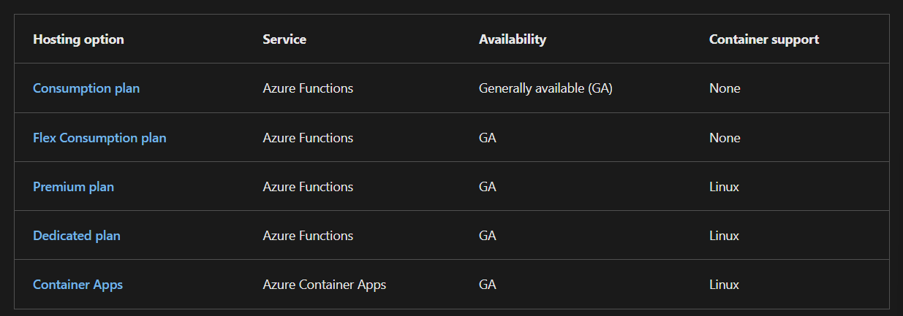
- Azure App Service infrastructure facilitates Azure Functions hosting on both Linux and Windows virtual machines. The hosting option you choose dictates the following behaviors:
- 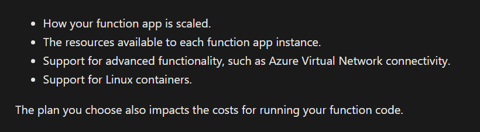

#### Overview of Plans
##### Consumption plan
- The Consumption plan is the default hosting plan. Pay for compute resources only when your functions are running (pay-as-you-go) with automatic scale. On the Consumption plan, instances of the Functions host are dynamically added and removed based on the number of incoming events.

##### Flex Consumption plan
- Get high scalability with compute choices, virtual networking, and pay-as-you-go billing. On the Flex Consumption plan, instances of the Functions host are dynamically added and removed based on the configured per instance concurrency and the number of incoming events.
- You can reduce cold starts by specifying the number of pre-provisioned (always ready) instances. Scales automatically based on demand.

##### Premium Plan
- Automatically scales based on demand using prewarmed workers, which run applications with no delay after being idle, runs on more powerful instances, and connects to virtual networks. Consider the Azure Functions Premium plan in the following situations:
- Your function apps run continuously, or nearly continuously.
- You want more control of your instances and want to deploy multiple function apps on the same plan with event-driven scaling.
- You need more CPU or memory options than are provided by consumption plans.
- You require virtual network connectivity.
- You want to provide a custom Linux image in which to run your functions.
- You have a high number of small executions and a high execution bill, but low GB seconds in the Consumption plan.

##### Dedicated Plan
- Run your functions within an App Service plan at regular App Service plan rates. Best for long-running scenarios where Durable Functions can't be used.
- Consider an App Service plan in the following situations:
- You must have fully predictable billing, or you need to manually scale instances.
- You want to run multiple web apps and function apps on the same plan
- You need access to larger compute size choices.
- Full compute isolation and secure network access provided by an App Service Environment (ASE).
- High memory usage and high scale (ASE).

##### Container Apps
- Create and deploy containerized function apps in a fully managed environment hosted by Azure Container Apps.
- Use the Azure Functions programming model to build event-driven, serverless, cloud native function apps. Run your functions alongside other microservices, APIs, websites, and workflows as container-hosted programs.
- Consider hosting your functions on Container Apps in the following situations:
- You want to package custom libraries with your function code to support line-of-business apps.
- You need to migrate code execution from on-premises or legacy apps to cloud native microservices running in containers.
- You want to avoid the overhead and complexity of managing Kubernetes clusters and dedicated compute.
- You need the high-end processing power provided by dedicated CPU compute resources for your functions.

### Function App TImeout Duration
- The functionTimeout property in the host.json project file specifies the time-out duration for functions in a function app. This property applies specifically to function executions. After the trigger starts function execution, the function needs to return/respond within the time-out duration.
- 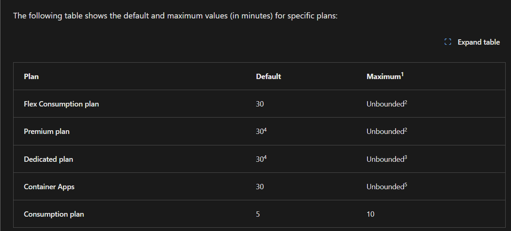
- Regardless of the function app time-out setting, 230 seconds is the maximum amount of time that an HTTP triggered function can take to respond to a request. This is because of the default idle time-out of Azure Load Balancer. For longer processing times, consider using the Durable Functions async pattern or defer the actual work and return an immediate response.
- (Premium Plan): There's no maximum execution time-out duration enforced. However, the grace period given to a function execution is 60 minutes during scale in for the Flex Consumption and Premium plans, and a grace period of 10 minutes is given during platform updates.
- (Dedicated Plan) Requires the App Service plan be set to Always On. A grace period of 10 minutes is given during platform updates.
- In Premium and Dedicated plans the default time-out for version 1.x of the Functions host runtime is unbounded.
- For the container apps, when the minimum number of replicas is set to zero, the default time-out depends on the specific triggers used in the app.


## Scale Azure Functions
- The following table compares the scaling behaviors of the various hosting plans. Maximum instances are given on a per-function app (Consumption) or per-plan (Premium/Dedicated) basis, unless otherwise indicated.
- 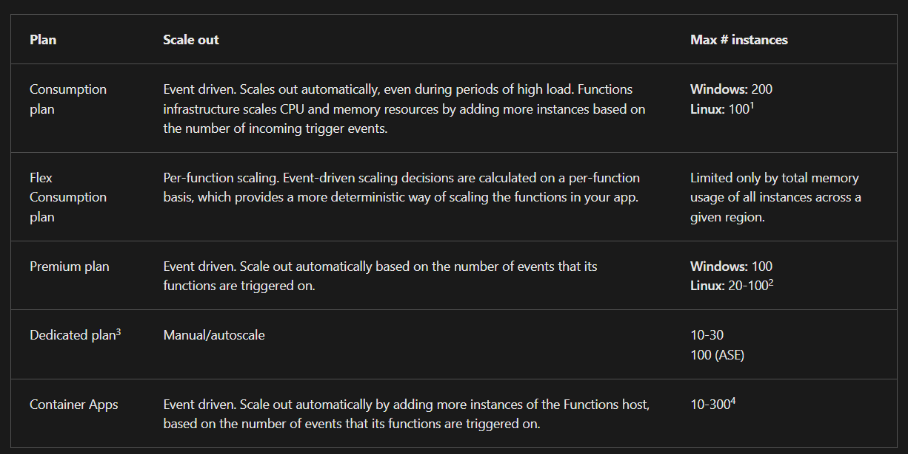
- In Consumption plan, during scale-out, there's currently a limit of 500 instances per subscription per hour for Linux 1. apps on a Consumption plan.
- In some regions, Linux apps on a Premium plan can scale to 100 instances.
- On Container Apps, you can set the maximum number of replicas, which is honored as long as there's enough cores quota available

## Develop Azure Functions
- A function app provides an execution context in Azure in which your functions run. As such, it's the unit of deployment and management for your functions. 
- A function app is composed of one or more individual functions that are managed, deployed, and scaled together. 
- All of the functions in a function app share the same pricing plan, deployment method, and runtime version. 
- Think of a function app as a way to organize and collectively manage your functions.
- In Functions 2.x, all functions in a function app must be authored in the same language. In previous versions of the Azure Functions runtime, this wasn't required.
- Functions make it easy to use your favorite code editor and development tools to create and test functions on your local computer. Your local functions can connect to live Azure services, and you can debug them on your local computer using the full Functions runtime.
- Because of limitations on editing function code in the Azure portal, you should develop your functions locally and publish your code project to a function app in Azure.

### Local Project Files
- A Functions project directory contains the following files in the project root folder, regardless of language:
- host.json
- local.settings.json
- Other files in the project depend on your language and specific functions.
- The host.json metadata file contains configuration options that affect all functions in a function app instance. 
- Other function app configuration options are managed depending on where the function app runs:
- Deployed to Azure: in your application settings
- On your local computer: in the local.settings.json file.
- Configurations in host.json related to bindings are applied equally to each function in the function app. You can also override or apply settings per environment using application settings. 
- The local.settings.json file stores app settings, and settings used by local development tools. Settings in the local.settings.json file are used only when you're running your project locally. When you publish your project to Azure, be sure to also add any required settings to the app settings for the function app.
- Because the local.settings.json may contain secrets, such as connection strings, you should never store it in a remote repository.
- When you develop your functions locally, any local settings required by your app must also be present in the app settings of the deployed function app. 
- You can also download current settings from the function app to your local project.

### Create Triggers and Bindings
- A trigger defines how a function is invoked and a function must have exactly one trigger. Triggers have associated data, which is often provided as the payload of the function.
- Binding to a function is a way of declaratively connecting another resource to the function; bindings might be connected as input bindings, output bindings, or both. Data from bindings is provided to the function as parameters.
- You can mix and match different bindings to suit your needs. Bindings are optional and a function might have one or multiple input and/or output bindings.
- Triggers and bindings let you avoid hardcoding access to other services. Your function receives data (for example, the content of a queue message) in function parameters. You send data (for example, to create a queue message) by using the return value of the function.
- When you develop your functions locally, you need to take trigger and binding behaviors into consideration. For HTTP triggers, you can call the HTTP endpoint on the local computer, using http://localhost/.
- For non-HTTP triggered functions, there are several options to run locally:
- The easiest way to test bindings during local development is to use connection strings that target live Azure services. You can target live services by adding the appropriate connection string settings in the Values array in the local.settings.json file. When you do this, local executions during testing use live service data. Because of this, consider setting-up separate services to use during development and testing, and then switch to different services during production.
- For storage-based triggers, you can use the local Azurite emulator when testing functions with Azure Storage bindings (Queue Storage, Blob Storage, and Table Storage), without having to connect to remote storage services.
- You can manually run non-HTTP trigger functions by using special administrator endpoints
- 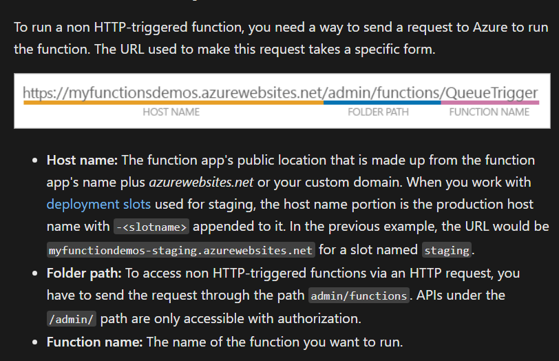
- 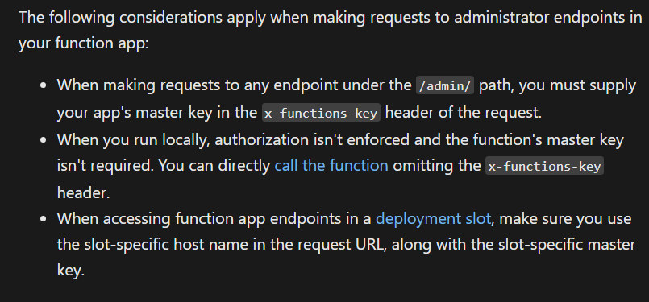
- 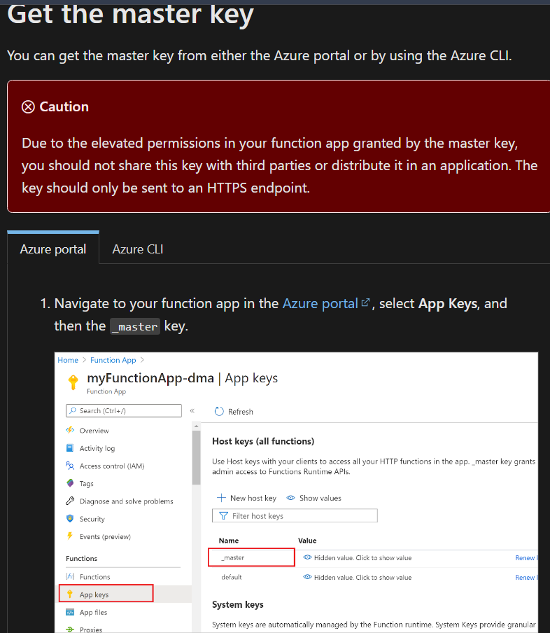
- 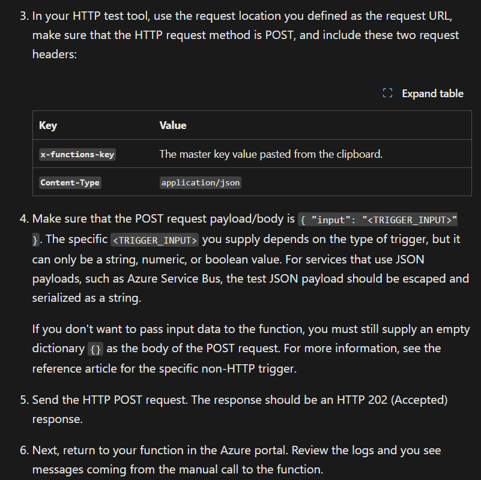

### Trigger and Binding Definitions
- 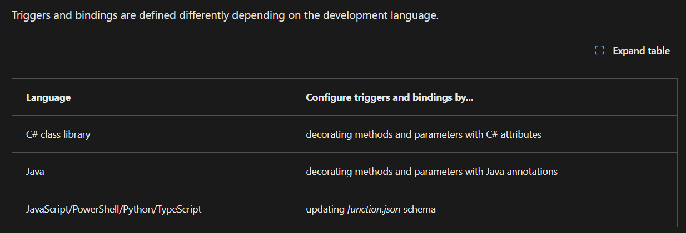
- For languages that rely on function.json, the portal provides a UI for adding bindings in the Integration tab. You can also edit the file directly in the portal in the Code + test tab of your function.

- In .NET and Java, the parameter type defines the data type for input data. For instance, use string to bind to the text of a queue trigger, a byte array to read as binary, and a custom type to deserialize to an object. Since .NET class library functions and Java functions don't rely on function.json for binding definitions, they can't be created and edited in the portal. C# portal editing is based on C# script, which uses function.json instead of attributes.
- For languages that are dynamically typed such as JavaScript, use the dataType property in the function.json file. For example, to read the content of an HTTP request in binary format, set dataType to binary:
```json
{
    "dataType": "binary",
    "type": "httpTrigger",
    "name": "req",
    "direction": "in"
}

```
- Other options for dataType are stream and string.

#### Binding Direction
- All triggers and bindings have a direction property in the function.json file:
- For triggers, the direction is always in
- Input and output bindings use in and out
- Some bindings support a special direction inout. 
- If you use inout, only the Advanced editor is available via the Integrate tab in the portal.
- When you use attributes in a class library to configure triggers and bindings, the direction is provided in an attribute constructor or inferred from the parameter type.

##### Azure Functions trigger and binding example
- Suppose you want to write a new row to Azure Table storage whenever a new message appears in Azure Queue storage. This scenario can be implemented using an Azure Queue storage trigger and an Azure Table storage output binding.
- Here's a function.json file for this scenario.

```json
{
  "disabled": false,
    "bindings": [
        {
            "type": "queueTrigger",
            "direction": "in",
            "name": "myQueueItem",
            "queueName": "myqueue-items",
            "connection":"MyStorageConnectionAppSetting"
        },
        {
          "tableName": "Person",
          "connection": "MyStorageConnectionAppSetting",
          "name": "tableBinding",
          "type": "table",
          "direction": "out"
        }
  ]
}


```
- The first element in the bindings array is the Queue storage trigger. The type and direction properties identify the trigger. The name property identifies the function parameter that receives the queue message content. The name of the queue to monitor is in queueName, and the connection string is in the app setting identified by connection.


- The second element in the bindings array is the Azure Table Storage output binding. The type and direction properties identify the binding. The name property specifies how the function provides the new table row, in this case by using the function return value. The name of the table is in tableName, and the connection string is in the app setting identified by connection.

##### C# Function Example
- Following is the same example represented in a C# function. The same trigger and binding information, queue and table names, storage accounts, and function parameters for input and output are provided by attributes instead of a function.json file.
```c#
public static class QueueTriggerTableOutput
{
    [FunctionName("QueueTriggerTableOutput")]
    [return: Table("outTable", Connection = "MY_TABLE_STORAGE_ACCT_APP_SETTING")]
    public static Person Run(
        [QueueTrigger("myqueue-items", Connection = "MY_STORAGE_ACCT_APP_SETTING")]JObject order,
        ILogger log)
    {
        return new Person() {
                PartitionKey = "Orders",
                RowKey = Guid.NewGuid().ToString(),
                Name = order["Name"].ToString(),
                MobileNumber = order["MobileNumber"].ToString() };
    }
}

public class Person
{
    public string PartitionKey { get; set; }
    public string RowKey { get; set; }
    public string Name { get; set; }
    public string MobileNumber { get; set; }
}

```

### Connect Functions to Azure Services
- As a security best practice, Azure Functions takes advantage of the **application settings** functionality of Azure App Service to help you more securely store strings, keys, and other tokens required to connect to other services.
- **Application settings** in Azure are stored encrypted and accessed at runtime by your app as environment variable name value pairs. 
-  For triggers and bindings that require a connection property, you set the application setting name instead of the actual connection string. You can't configure a binding directly with a connection string or key.
-  The default configuration provider uses environment variables. These variables are defined in application settings when running in the Azure and in the local settings file when developing locally.

### Configure an Identity-Based Connection
- Some connections in Azure Functions are configured to use an identity instead of a secret. Support depends on the extension using the connection. In some cases, a connection string might still be required in Functions even though the service to which you're connecting supports identity-based connections.
- An app running in a Consumption or Elastic Premium plan, uses the WEBSITE_AZUREFILESCONNECTIONSTRING and WEBSITE_CONTENTSHARE settings when connecting to Azure Files on the storage account used by your function app. Azure Files doesn't support using managed identity when accessing the file share.
- When hosted in the Azure Functions service, identity-based connections use a managed identity. The system-assigned identity is used by default, although a user-assigned identity can be specified with the credential and clientID properties. Configuring a user-assigned identity with a resource ID is not supported. When run in other contexts, such as local development, your developer identity is used instead, although this can be customized.

### Grant Permission to the Identity
- Identities must have permissions to perform the intended actions. This is typically done by assigning a role in Azure role-based access control or specifying the identity in an access policy, depending on the service to which you're connecting.
- Some permissions might be exposed by the target service that aren't necessary for all contexts. Where possible, adhere to the principle of least privilege, granting the identity only required privileges.
- 


