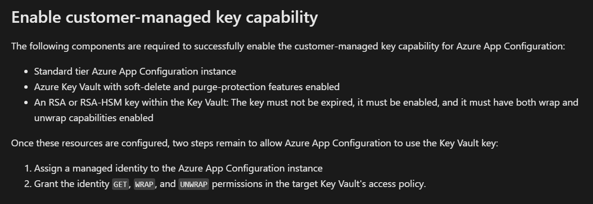

# AZ204 Training
Azure Developer Training

## Azure Functions
- Azure Functions lets you develop serverless applications on Microsoft Azure. You can write just the code you need for the problem at hand, without worrying about a whole application or the infrastructure to run it.
- We often build systems to react to a series of critical events. Whether you're building a web API, responding to database changes, processing IoT data streams, or even managing message queues - every application needs a way to run some code as these events occur.

### Azure Functions vs Logic Apps
- Azure Functions supports triggers, which are ways to start execution of your code, and bindings, which are ways to simplify coding for input and output data. There are other integration and automation services in Azure and they all can solve integration problems and automate business processes. They can all define input, actions, conditions, and output.
- Both Functions and Logic Apps are Azure Services that enable serverless workloads. Azure Functions is a serverless compute service, whereas Azure Logic Apps is a serverless workflow integration platform. Both can create complex orchestrations. An orchestration is a collection of functions or steps, called actions in Logic Apps, that are executed to accomplish a complex task.
- 

### Azure Functions vs WebJobs
- Like Azure Functions, Azure App Service WebJobs with the WebJobs SDK is a code-first integration service that is designed for developers. Both are built on Azure App Service and support features such as source control integration, authentication, and monitoring with Application Insights integration.
- Azure Functions is built on the WebJobs SDK, so it shares many of the same event triggers and connections to other Azure services.
- 
- Azure Functions offers more developer productivity than Azure App Service WebJobs does. It also offers more options for programming languages, development environments, Azure service integration, and pricing. For most scenarios, it's the best choice.

### Azure Functions Hosting Options
- 
- Azure App Service infrastructure facilitates Azure Functions hosting on both Linux and Windows virtual machines. The hosting option you choose dictates the following behaviors:
- 

#### Overview of Plans
##### Consumption plan
- The Consumption plan is the default hosting plan. Pay for compute resources only when your functions are running (pay-as-you-go) with automatic scale. On the Consumption plan, instances of the Functions host are dynamically added and removed based on the number of incoming events.

##### Flex Consumption plan
- Get high scalability with compute choices, virtual networking, and pay-as-you-go billing. On the Flex Consumption plan, instances of the Functions host are dynamically added and removed based on the configured per instance concurrency and the number of incoming events.
- You can reduce cold starts by specifying the number of pre-provisioned (always ready) instances. Scales automatically based on demand.

##### Premium Plan
- Automatically scales based on demand using prewarmed workers, which run applications with no delay after being idle, runs on more powerful instances, and connects to virtual networks. Consider the Azure Functions Premium plan in the following situations:
- Your function apps run continuously, or nearly continuously.
- You want more control of your instances and want to deploy multiple function apps on the same plan with event-driven scaling.
- You need more CPU or memory options than are provided by consumption plans.
- You require virtual network connectivity.
- You want to provide a custom Linux image in which to run your functions.
- You have a high number of small executions and a high execution bill, but low GB seconds in the Consumption plan.

##### Dedicated Plan
- Run your functions within an App Service plan at regular App Service plan rates. Best for long-running scenarios where Durable Functions can't be used.
- Consider an App Service plan in the following situations:
- You must have fully predictable billing, or you need to manually scale instances.
- You want to run multiple web apps and function apps on the same plan
- You need access to larger compute size choices.
- Full compute isolation and secure network access provided by an App Service Environment (ASE).
- High memory usage and high scale (ASE).

##### Container Apps
- Create and deploy containerized function apps in a fully managed environment hosted by Azure Container Apps.
- Use the Azure Functions programming model to build event-driven, serverless, cloud native function apps. Run your functions alongside other microservices, APIs, websites, and workflows as container-hosted programs.
- Consider hosting your functions on Container Apps in the following situations:
- You want to package custom libraries with your function code to support line-of-business apps.
- You need to migrate code execution from on-premises or legacy apps to cloud native microservices running in containers.
- You want to avoid the overhead and complexity of managing Kubernetes clusters and dedicated compute.
- You need the high-end processing power provided by dedicated CPU compute resources for your functions.

### Function App TImeout Duration
- The functionTimeout property in the host.json project file specifies the time-out duration for functions in a function app. This property applies specifically to function executions. After the trigger starts function execution, the function needs to return/respond within the time-out duration.
- 
- Regardless of the function app time-out setting, 230 seconds is the maximum amount of time that an HTTP triggered function can take to respond to a request. This is because of the default idle time-out of Azure Load Balancer. For longer processing times, consider using the Durable Functions async pattern or defer the actual work and return an immediate response.
- (Premium Plan): There's no maximum execution time-out duration enforced. However, the grace period given to a function execution is 60 minutes during scale in for the Flex Consumption and Premium plans, and a grace period of 10 minutes is given during platform updates.
- (Dedicated Plan) Requires the App Service plan be set to Always On. A grace period of 10 minutes is given during platform updates.
- In Premium and Dedicated plans the default time-out for version 1.x of the Functions host runtime is unbounded.
- For the container apps, when the minimum number of replicas is set to zero, the default time-out depends on the specific triggers used in the app.


## Scale Azure Functions
- The following table compares the scaling behaviors of the various hosting plans. Maximum instances are given on a per-function app (Consumption) or per-plan (Premium/Dedicated) basis, unless otherwise indicated.
- 
- In Consumption plan, during scale-out, there's currently a limit of 500 instances per subscription per hour for Linux 1. apps on a Consumption plan.
- In some regions, Linux apps on a Premium plan can scale to 100 instances.
- On Container Apps, you can set the maximum number of replicas, which is honored as long as there's enough cores quota available

## Develop Azure Functions
- A function app provides an execution context in Azure in which your functions run. As such, it's the unit of deployment and management for your functions. 
- A function app is composed of one or more individual functions that are managed, deployed, and scaled together. 
- All of the functions in a function app share the same pricing plan, deployment method, and runtime version. 
- Think of a function app as a way to organize and collectively manage your functions.
- In Functions 2.x, all functions in a function app must be authored in the same language. In previous versions of the Azure Functions runtime, this wasn't required.
- Functions make it easy to use your favorite code editor and development tools to create and test functions on your local computer. Your local functions can connect to live Azure services, and you can debug them on your local computer using the full Functions runtime.
- Because of limitations on editing function code in the Azure portal, you should develop your functions locally and publish your code project to a function app in Azure.

### Local Project Files
- A Functions project directory contains the following files in the project root folder, regardless of language:
- host.json
- local.settings.json
- Other files in the project depend on your language and specific functions.
- The host.json metadata file contains configuration options that affect all functions in a function app instance. 
- Other function app configuration options are managed depending on where the function app runs:
- Deployed to Azure: in your application settings
- On your local computer: in the local.settings.json file.
- Configurations in host.json related to bindings are applied equally to each function in the function app. You can also override or apply settings per environment using application settings. 
- The local.settings.json file stores app settings, and settings used by local development tools. Settings in the local.settings.json file are used only when you're running your project locally. When you publish your project to Azure, be sure to also add any required settings to the app settings for the function app.
- Because the local.settings.json may contain secrets, such as connection strings, you should never store it in a remote repository.
- When you develop your functions locally, any local settings required by your app must also be present in the app settings of the deployed function app. 
- You can also download current settings from the function app to your local project.

### Create Triggers and Bindings
- A trigger defines how a function is invoked and a function must have exactly one trigger. Triggers have associated data, which is often provided as the payload of the function.
- Binding to a function is a way of declaratively connecting another resource to the function; bindings might be connected as input bindings, output bindings, or both. Data from bindings is provided to the function as parameters.
- You can mix and match different bindings to suit your needs. Bindings are optional and a function might have one or multiple input and/or output bindings.
- Triggers and bindings let you avoid hardcoding access to other services. Your function receives data (for example, the content of a queue message) in function parameters. You send data (for example, to create a queue message) by using the return value of the function.
- When you develop your functions locally, you need to take trigger and binding behaviors into consideration. For HTTP triggers, you can call the HTTP endpoint on the local computer, using http://localhost/.
- For non-HTTP triggered functions, there are several options to run locally:
- The easiest way to test bindings during local development is to use connection strings that target live Azure services. You can target live services by adding the appropriate connection string settings in the Values array in the local.settings.json file. When you do this, local executions during testing use live service data. Because of this, consider setting-up separate services to use during development and testing, and then switch to different services during production.
- For storage-based triggers, you can use the local Azurite emulator when testing functions with Azure Storage bindings (Queue Storage, Blob Storage, and Table Storage), without having to connect to remote storage services.
- You can manually run non-HTTP trigger functions by using special administrator endpoints
- 
- 
- 
- 

### Trigger and Binding Definitions
- 
- For languages that rely on function.json, the portal provides a UI for adding bindings in the Integration tab. You can also edit the file directly in the portal in the Code + test tab of your function.

- In .NET and Java, the parameter type defines the data type for input data. For instance, use string to bind to the text of a queue trigger, a byte array to read as binary, and a custom type to deserialize to an object. Since .NET class library functions and Java functions don't rely on function.json for binding definitions, they can't be created and edited in the portal. C# portal editing is based on C# script, which uses function.json instead of attributes.
- For languages that are dynamically typed such as JavaScript, use the dataType property in the function.json file. For example, to read the content of an HTTP request in binary format, set dataType to binary:
```json
{
    "dataType": "binary",
    "type": "httpTrigger",
    "name": "req",
    "direction": "in"
}

```
- Other options for dataType are stream and string.

#### Binding Direction
- All triggers and bindings have a direction property in the function.json file:
- For triggers, the direction is always in
- Input and output bindings use in and out
- Some bindings support a special direction inout. 
- If you use inout, only the Advanced editor is available via the Integrate tab in the portal.
- When you use attributes in a class library to configure triggers and bindings, the direction is provided in an attribute constructor or inferred from the parameter type.

##### Azure Functions trigger and binding example
- Suppose you want to write a new row to Azure Table storage whenever a new message appears in Azure Queue storage. This scenario can be implemented using an Azure Queue storage trigger and an Azure Table storage output binding.
- Here's a function.json file for this scenario.

```json
{
  "disabled": false,
    "bindings": [
        {
            "type": "queueTrigger",
            "direction": "in",
            "name": "myQueueItem",
            "queueName": "myqueue-items",
            "connection":"MyStorageConnectionAppSetting"
        },
        {
          "tableName": "Person",
          "connection": "MyStorageConnectionAppSetting",
          "name": "tableBinding",
          "type": "table",
          "direction": "out"
        }
  ]
}


```
- The first element in the bindings array is the Queue storage trigger. The type and direction properties identify the trigger. The name property identifies the function parameter that receives the queue message content. The name of the queue to monitor is in queueName, and the connection string is in the app setting identified by connection.


- The second element in the bindings array is the Azure Table Storage output binding. The type and direction properties identify the binding. The name property specifies how the function provides the new table row, in this case by using the function return value. The name of the table is in tableName, and the connection string is in the app setting identified by connection.

##### C# Function Example
- Following is the same example represented in a C# function. The same trigger and binding information, queue and table names, storage accounts, and function parameters for input and output are provided by attributes instead of a function.json file.
```c#
public static class QueueTriggerTableOutput
{
    [FunctionName("QueueTriggerTableOutput")]
    [return: Table("outTable", Connection = "MY_TABLE_STORAGE_ACCT_APP_SETTING")]
    public static Person Run(
        [QueueTrigger("myqueue-items", Connection = "MY_STORAGE_ACCT_APP_SETTING")]JObject order,
        ILogger log)
    {
        return new Person() {
                PartitionKey = "Orders",
                RowKey = Guid.NewGuid().ToString(),
                Name = order["Name"].ToString(),
                MobileNumber = order["MobileNumber"].ToString() };
    }
}

public class Person
{
    public string PartitionKey { get; set; }
    public string RowKey { get; set; }
    public string Name { get; set; }
    public string MobileNumber { get; set; }
}

```

### Connect Functions to Azure Services
- As a security best practice, Azure Functions takes advantage of the **application settings** functionality of Azure App Service to help you more securely store strings, keys, and other tokens required to connect to other services.
- **Application settings** in Azure are stored encrypted and accessed at runtime by your app as environment variable name value pairs. 
-  For triggers and bindings that require a connection property, you set the application setting name instead of the actual connection string. You can't configure a binding directly with a connection string or key.
-  The default configuration provider uses environment variables. These variables are defined in application settings when running in the Azure and in the local settings file when developing locally.

### Configure an Identity-Based Connection
- Some connections in Azure Functions are configured to use an identity instead of a secret. Support depends on the extension using the connection. In some cases, a connection string might still be required in Functions even though the service to which you're connecting supports identity-based connections.
- An app running in a Consumption or Elastic Premium plan, uses the WEBSITE_AZUREFILESCONNECTIONSTRING and WEBSITE_CONTENTSHARE settings when connecting to Azure Files on the storage account used by your function app. Azure Files doesn't support using managed identity when accessing the file share.
- When hosted in the Azure Functions service, identity-based connections use a managed identity. The system-assigned identity is used by default, although a user-assigned identity can be specified with the credential and clientID properties. Configuring a user-assigned identity with a resource ID is not supported. When run in other contexts, such as local development, your developer identity is used instead, although this can be customized.

### Grant Permission to the Identity
- Identities must have permissions to perform the intended actions. This is typically done by assigning a role in Azure role-based access control or specifying the identity in an access policy, depending on the service to which you're connecting.
- Some permissions might be exposed by the target service that aren't necessary for all contexts. Where possible, adhere to the principle of least privilege, granting the identity only required privileges.

## Implement Azure Key Vault
- Azure Key Vault is a cloud service for securely storing and accessing secrets. A secret is anything that you want to tightly control access to, such as API keys, passwords, certificates, or cryptographic keys.
- The Azure Key Vault service supports two types of containers: vaults and managed hardware security module(HSM) pools. Vaults support storing software and HSM-backed keys, secrets, and certificates. Managed HSM pools only support HSM-backed keys.
- Azure Key Vault helps solve the following problems:
- **Secrets Management**: Azure Key Vault can be used to Securely store and tightly control access to tokens, passwords, certificates, API keys, and other secrets
- **Key Management**: Azure Key Vault can also be used as a Key Management solution. Azure Key Vault makes it easy to create and control the encryption keys used to encrypt your data.
- **Certificate Management**: Azure Key Vault is also a service that lets you easily provision, manage, and deploy public and private Secure Sockets Layer/Transport Layer Security (SSL/TLS) certificates for use with Azure and your internal connected resources.
- Azure Key Vault has two service tiers: Standard, which encrypts with a software key, and a Premium tier, which includes hardware security module(HSM)-protected keys.

## Key Benefits of using Azure Key Vault
- **Centralized application secrets**: Centralizing storage of application secrets in Azure Key Vault allows you to control their distribution. For example, instead of storing the connection string in the app's code you can store it securely in Key Vault. Your applications can securely access the information they need by using URIs. These URIs allow the applications to retrieve specific versions of a secret.
- **Securely store secrets and keys**: Access to a key vault requires proper authentication and authorization before a caller (user or application) can get access. Authentication is done via Microsoft Entra ID. Authorization may be done via Azure role-based access control (Azure RBAC) or Key Vault access policy. Azure RBAC can be used for both management of the vaults and to access data stored in a vault, while key vault access policy can only be used when attempting to access data stored in a vault. Azure Key Vaults may be either software-protected or, with the Azure Key Vault Premium tier, hardware-protected by hardware security modules (HSMs).
- **Monitor access and use**: You can monitor activity by enabling logging for your vaults. You have control over your logs and you may secure them by restricting access and you may also delete logs that you no longer need. Azure Key Vault can be configured to:

- Archive to a storage account.
- Stream to an event hub.
- Send the logs to Azure Monitor logs.

- **Simplified administration of application secrets**: Security information must be secured, it must follow a life cycle, and it must be highly available. Azure Key Vault simplifies the process of meeting these requirements by:

- Removing the need for in-house knowledge of Hardware Security Modules
- Scaling up on short notice to meet your organization’s usage spikes.
- Replicating the contents of your Key Vault within a region and to a secondary region. Data replication ensures high availability and takes away the need of any action from the administrator to trigger the failover.
- Providing standard Azure administration options via the portal, Azure CLI and PowerShell.
- Automating certain tasks on certificates that you purchase from Public CAs, such as enrollment and renewal.

## Azure Key Vault Best practices
- Azure Key Vault is a tool for securely storing and accessing secrets. A secret is anything that you want to tightly control access to, such as API keys, passwords, or certificates. A vault is logical group of secrets.

### Authenticating to the Key Vault
- To do any operations with Key Vault, you first need to authenticate to it. There are three ways to authenticate to Key Vault
- **Managed identities for Azure resources**: When you deploy an app on a virtual machine in Azure, you can assign an identity to your virtual machine that has access to Key Vault. You can also assign identities to other Azure resources. The benefit of this approach is that the app or service isn't managing the rotation of the first secret. Azure automatically rotates the service principal client secret associated with the identity. ***We recommend this approach as a best practice***.
- **Service principal and certificate**: You can use a service principal and an associated certificate that has access to Key Vault. We don't recommend this approach because the application owner or developer must rotate the certificate.
- **Service principal and secret**: Although you can use a service principal and a secret to authenticate to Key Vault, we don't recommend it. It's hard to automatically rotate the bootstrap secret that's used to authenticate to Key Vault.

### Encryption of Data in Transit
- Azure Key Vault enforces Transport Layer Security (TLS) protocol to protect data when it’s traveling between Azure Key Vault and clients.
- Clients negotiate a TLS connection with Azure Key Vault. TLS provides strong authentication, message privacy, and integrity (enabling detection of message tampering, interception, and forgery), interoperability, algorithm flexibility, and ease of deployment and use.
- Perfect Forward Secrecy (PFS) protects connections between customers’ client systems and Microsoft cloud services by unique keys. Connections also use RSA-based 2,048-bit encryption key lengths. This combination makes it difficult for someone to intercept and access data that is in transit.

### Azure Key Vault Best Practices
- **Use separate key vaults**: Recommended using a vault per application per environment (Development, Pre-Production and Production). This pattern helps you not share secrets across environments and also reduces the threat if there is a breach.
- **Control access to your vault**: Key Vault data is sensitive and business critical, you need to secure access to your key vaults by allowing only authorized applications and users.
- **Backup**: Create regular back ups of your vault on update/delete/create of objects within a Vault.
- **Logging**: Be sure to turn on logging and alerts.
- **Recovery options**: Turn on soft-delete and purge protection if you want to guard against force deletion of the secret.

### Authenticate to Azure Key Vault
- Authentication with Key Vault works with Microsoft Entra ID, which is responsible for authenticating the identity of any given security principal.
- For applications, there are two ways to obtain a service principal:
- Enable a system-assigned managed identity for the application. With managed identity, Azure internally manages the application's service principal and automatically authenticates the application with other Azure services. Managed identity is available for applications deployed to various services.
- If you can't use managed identity, you instead register the application with your Microsoft Entra tenant. Registration also creates a second application object that identifies the app across all tenants.
 
 ##### It is recommended to use a system-assigned managed identity.

### Authentication to Key Vault in application code
 - Key Vault SDK is using Azure Identity client library, which allows seamless authentication to Key Vault across environments with same code.

### Authentication to Key Vault with REST
- Access tokens must be sent to the service using the HTTP Authorization header:
```json
PUT /keys/MYKEY?api-version=<api_version>  HTTP/1.1  
Authorization: Bearer <access_token>
```
When an access token isn't supplied, or when a token isn't accepted by the service, an HTTP 401 error is returned to the client and will include the WWW-Authenticate header, for example:

```json
401 Not Authorized  
WWW-Authenticate: Bearer authorization="…", resource="…"
```
- The parameters on the WWW-Authenticate header are:
- authorization: The address of the OAuth2 authorization service that may be used to obtain an access token for the request.
- resource: The name of the resource (https://vault.azure.net) to use in the authorization request.

```shell
# Set some variables to avoid retyping
myKeyVault=az204vault-$RANDOM
myLocation=<myLocation>

# Create a resource group
az group create --name az204-vault-rg --location $myLocation

# Create a key vault
az keyvault create --name $myKeyVault --resource-group az204-vault-rg --location $myLocation

# Set a keyvault secret
az keyvault secret set --vault-name $myKeyVault --name "ExamplePassword" --value "hVFkk965BuUv"

# Retrieve the secret
az keyvault secret show --name "ExamplePassword" --vault-name $myKeyVault

# Value returned is "value": "hVFkk965BuUv"
```

## Azure App Configuration Service
- Azure App Configuration provides a service to centrally manage application settings and feature flags.
- Modern programs, especially programs running in a cloud, generally have many components that are distributed in nature. Spreading configuration settings across these components can lead to hard-to-troubleshoot errors during an application deployment. Use App Configuration to store all the settings for your application and secure their accesses in one place.
- App Configuration offers the following benefits:
- A fully managed service that can be set up in minutes
- Flexible key representations and mappings
- Tagging with labels
- Point-in-time replay of settings
- Dedicated UI for feature flag management
- Comparison of two sets of configurations on custom-defined dimensions
- Enhanced security through Azure-managed identities
- Encryption of sensitive information at rest and in transit
- Native integration with popular frameworks
- App Configuration complements Azure Key Vault, which is used to store application secrets. App Configuration makes it easier to implement the following scenarios:
- Centralize management and distribution of hierarchical configuration data for different environments and geographies
- Dynamically change application settings without the need to redeploy or restart an application
- Control feature availability in real-time
- The easiest way to add an App Configuration store to your application is through a client library that Microsoft provides.

### Create Paired Keys and Values
- Azure App Configuration stores configuration data as key-value pairs.
- Keys serve as the name for key-value pairs and are used to store and retrieve corresponding values. It's a common practice to organize keys into a hierarchical namespace by using a character delimiter, such as / or :. Use a convention that's best suited for your application. App Configuration treats keys as a whole. It doesn't parse keys to figure out how their names are structured or enforce any rule on them.
```c#
AppName:Service1:ApiEndpoint
AppName:Service2:ApiEndpoint
```
- Keys stored in App Configuration are case-sensitive, unicode-based strings. The keys app1 and App1 are distinct in an App Configuration store. Keep this in mind when you use configuration settings within an application because some frameworks handle configuration keys case-insensitively.
- You can use any unicode character in key names entered into App Configuration except for *, ,, and \. These characters are reserved. If you need to include a reserved character, you must escape it by using \{Reserved Character}. There's a combined size limit of 10,000 characters on a key-value pair. This limit includes all characters in the key, its value, and all associated optional attributes. Within this limit, you can have many hierarchical levels for keys.

### Design Key Namespaces
- There are two general approaches to naming keys used for configuration data: flat or hierarchical. These methods are similar from an application usage standpoint, but hierarchical naming offers many advantages:
- Easier to read. Instead of one long sequence of characters, delimiters in a hierarchical key name function as spaces in a sentence.
- Easier to manage. A key name hierarchy represents logical groups of configuration data.
- Easier to use. It's simpler to write a query that pattern-matches keys in a hierarchical structure and retrieves only a portion of configuration data.

### Label Keys
- Key-values in App Configuration can optionally have a label attribute
- Labels are used to differentiate key-values with the same key
- A key app1 with labels A and B forms two separate keys in an App Configuration store
- By default, a key-value has no label. To explicitly reference a key-value without a label, use \0 (URL encoded as %00).
- 
###  Version key values
App Configuration doesn't version key values automatically as they're modified. Use labels as a way to create multiple versions of a key value. For example, you can input an application version number or a Git commit ID in labels to identify key values associated with a particular software build.

### Query key values
- Each key-value is uniquely identified by its key plus a label that can be \0. You query an App Configuration store for key-values by specifying a pattern. The App Configuration store returns all key-values that match the pattern including their corresponding values and attributes.

### Values
- Values assigned to keys are also unicode strings. 
- You can use all unicode characters for values. There's an optional user-defined content type associated with each value. Use this attribute to store information, for example an encoding scheme, about a value that helps your application to process it properly.
- Configuration data stored in an App Configuration store, which includes all keys and values, is encrypted at rest and in transit. App Configuration isn't a replacement solution for Azure Key Vault. Don't store application secrets in it.

## Manage Application Features
- Feature management is a modern software-development practice that decouples feature release from code deployment and enables quick changes to feature availability on demand. It uses a technique called feature flags (also known as feature toggles, feature switches, and so on) to dynamically administer a feature's lifecycle.
- **Feature flag**: A feature flag is a variable with a binary state of on or off. The feature flag also has an associated code block. The state of the feature flag triggers whether the code block runs or not.
- **Feature manager**: A feature manager is an application package that handles the lifecycle of all the feature flags in an application. The feature manager typically provides extra functionality, such as caching feature flags and updating their states
- **Filter**: A filter is a rule for evaluating the state of a feature flag. A user group, a device or browser type, a geographic location, and a time window are all examples of what a filter can represent.
- An effective implementation of feature management consists of at least two components working in concert:
- An application that makes use of feature flags.
- A separate repository that stores the feature flags and their current states.

### Using Feature Flags in code
```c#
bool featureFlag = isBetaUser();

if (featureFlag) {
    // Run the following code
}

if (featureFlag) {
    // This following code will run if the featureFlag value is true
} else {
    // This following code will run if the featureFlag value is false
}

```

## Feature Flag Declaration
- Each feature flag has two parts: a name and a list of one or more filters that are used to evaluate if a feature's state is on (that is, when its value is True). A filter defines a use case for when a feature should be turned on.
- When a feature flag has multiple filters, the filter list is traversed in order until one of the filters determines the feature should be enabled. At that point, the feature flag is on, and any remaining filter results are skipped. If no filter indicates the feature should be enabled, the feature flag is off.
- The feature manager supports appsettings.json as a configuration source for feature flags. The following example shows how to set up feature flags in a JSON file:
```json
"FeatureManagement": {
    "FeatureA": true, // Feature flag set to on
    "FeatureB": false, // Feature flag set to off
    "FeatureC": {
        "EnabledFor": [
            {
                "Name": "Percentage",
                "Parameters": {
                    "Value": 50
                }
            }
        ]
    }
}

```

### Feature Flag Repository
- To use feature flags effectively, you need to externalize all the feature flags used in an application. This approach allows you to change feature flag states without modifying and redeploying the application itself.
- Azure App Configuration is designed to be a centralized repository for feature flags. You can use it to define different kinds of feature flags and manipulate their states quickly and confidently. You can then use the App Configuration libraries for various programming language frameworks to easily access these feature flags from your application.
  
### Secure App Configuration Data
- We can secure apps configuration data by using:
- Customer-managed keys
- Private endpoints
- Managed identities

#### Using Customer Managed Keys
- Azure App Configuration encrypts sensitive information at rest using a 256-bit AES encryption key provided by Microsoft. Every App Configuration instance has its own encryption key managed by the service and used to encrypt sensitive information. Sensitive information includes the values found in key-value pairs. When customer-managed key capability is enabled, App Configuration uses a managed identity assigned to the App Configuration instance to authenticate with Microsoft Entra ID. The managed identity then calls Azure Key Vault and wraps the App Configuration instance's encryption key.
- 

#### Using Private Endpoints for Azure App Configuration
- You can use private endpoints for Azure App Configuration to allow clients on a virtual network to securely access data over a private link. The private endpoint uses an IP address from the virtual network address space for your App Configuration store.
- Network traffic between the clients on the virtual network and the App Configuration store traverses over the virtual network using a private link on the Microsoft backbone network, eliminating exposure to the public internet.
- 

#### Managed Identities
- A managed identity from Microsoft Entra ID allows Azure App Configuration to easily access other Microsoft Entra ID-protected resources, such as Azure Key Vault. The identity is managed by the Azure platform. It doesn't require you to provision or rotate any secrets.
```shell

# Add a system-assigned identity
az appconfig identity assign \ 
    --name myTestAppConfigStore \ 
    --resource-group myResourceGroup


# Add a user-assigned identity
az identity create --resource-group myResourceGroup --name myUserAssignedIdentity

az appconfig identity assign --name myTestAppConfigStore \ 
    --resource-group myResourceGroup \ 
    --identities /subscriptions/[subscription id]/resourcegroups/myResourceGroup/providers/Microsoft.ManagedIdentity/userAssignedIdentities/myUserAssignedIdentity

```

## Monitor App Performance
- Instrumenting and monitoring your apps helps you maximize their availability and performance.

### Application Insights
- Application Insights is an extension of Azure Monitor and provides Application Performance Monitoring (APM) features. APM tools are useful to monitor applications from development, through test, and into production in the following ways:
- Proactively understand how an application is performing.
- Reactively review application execution data to determine the cause of an incident.
- In addition to collecting metrics and application telemetry data, which describe application activities and health, Application Insights can also be used to collect and store application trace logging data.
- The log trace is associated with other telemetry to give a detailed view of the activity. Adding trace logging to existing apps only requires providing a destination for the logs; the logging framework rarely needs to be changed.
- 
- Application Insights collects Metrics and application Telemetry data, which describe application activities and health, as well as trace logging data.
- Request rates, response times, and failure rates - Find out which pages are most popular, at what times of day, and where your users are. See which pages perform best. If your response times and failure rates go high when there are more requests, then perhaps you have a resourcing problem.
- Dependency rates, response times, and failure rates - Find out whether external services are slowing you down.
- Exceptions - Analyze the aggregated statistics, or pick specific instances and drill into the stack trace and related requests. Both server and browser exceptions are reported.
- Page views and load performance - reported by your users' browsers.
- AJAX calls from web pages - rates, response times, and failure rates.
- User and session counts.
Performance counters from your Windows or Linux server machines, such as CPU, memory, and network usage.
Host diagnostics from Docker or Azure.
Diagnostic trace logs from your app - so that you can correlate trace events with requests.
Custom events and metrics that you write yourself in the client or server code, to track business events such as items sold or games won.


- Application Insights is one of the many services hosted within Microsoft Azure, and telemetry is sent there for analysis and presentation. It's free to sign up, and if you choose the basic pricing plan of Application Insights, there's no charge until your application has grown to have substantial usage.

## Getting started with Application Insights
- There are several ways to get started monitoring and analyzing app performance:

- At run time: instrument your web app on the server. Ideal for applications already deployed. Avoids any update to the code.
- At development time: add Application Insights to your code. Allows you to customize telemetry collection and send more telemetry.
- Instrument your web pages for page view, AJAX, and other client-side telemetry.
- Analyze mobile app usage by integrating with Visual Studio App Center.
- Availability tests - ping your website regularly from our servers.

### Log Based Metrics
- Application Insights log-based metrics let you analyze the health of your monitored apps, create powerful dashboards, and configure alerts. There are two kinds of metrics:
- Log-based metrics behind the scene are translated into Kusto queries from stored events.
- Standard metrics are stored as preaggregated time series.
- Since standard metrics are preaggregated during collection, they have better performance at query time. Standard metrics are a better choice for dashboarding and in real-time alerting. The log-based metrics have more dimensions, which makes them the superior option for data analysis and ad-hoc diagnostics. 
- Developers can use the SDK to send events manually (by writing code that explicitly invokes the SDK) or they can rely on the automatic collection of events from autoinstrumentation.
-  the Application Insights backend stores all collected events as logs, and the Application Insights blades in the Azure portal act as an analytical and diagnostic tool for visualizing event-based data from logs.
-  Using logs to retain a complete set of events can bring great analytical and diagnostic value. For example, you can get an exact count of requests to a particular URL with the number of distinct users who made these calls. Or you can get detailed diagnostic traces, including exceptions and dependency calls for any user session. Having this type of information can significantly improve visibility into the application health and usage, allowing to cut down the time necessary to diagnose issues with an app.
-  At the same time, collecting a complete set of events may be impractical (or even impossible) for applications that generate a large volume of telemetry. For situations when the volume of events is too high, Application Insights implements several telemetry volume reduction techniques, such as sampling and filtering that reduces the number of collected and stored events. Unfortunately, lowering the number of stored events also lowers the accuracy of the metrics that, behind the scenes, must perform query-time aggregations of the events stored in logs.
-  The preaggregated metrics aren't stored as individual events with lots of properties. Instead, they're stored as preaggregated time series, and only with key dimensions. This makes the new metrics superior at query time: retrieving data happens faster and requires less compute power. This enables new scenarios such as near real-time alerting on dimensions of metrics, more responsive dashboards, and more.
#### Both, log-based and pre-aggregated metrics coexist in Application Insights. To differentiate the two, in the Application Insights UX the pre-aggregated metrics are now called "Standard metrics (preview)", while the traditional metrics from the events were renamed to "Log-based metrics".

- The newer SDKs (Application Insights 2.7 SDK or later for .NET) preaggregate metrics during collection. This applies to standard metrics sent by default so the accuracy isn't affected by sampling or filtering. It also applies to custom metrics sent using GetMetric resulting in less data ingestion and lower cost.
- or the SDKs that don't implement preaggregation the Application Insights backend still populates the new metrics by aggregating the events received by the Application Insights event collection endpoint. While you don't benefit from the reduced volume of data transmitted over the wire, you can still use the preaggregated metrics and experience better performance and support of the near real-time dimensional alerting with SDKs that don't preaggregate metrics during collection.
- It's worth mentioning that the collection endpoint preaggregates events before ingestion sampling, which means that ingestion sampling will never impact the accuracy of preaggregated metrics, regardless of the SDK version you use with your application.

## Instrument an app for Monitoring
- At a basic level, "instrumenting" is simply enabling an application to capture telemetry. There are two methods to instrument your application:

- Automatic instrumentation (autoinstrumentation)
- Manual instrumentation
- Autoinstrumentation enables telemetry collection through configuration without touching the application's code. Although it's more convenient, it tends to be less configurable.
- When autoinstrumentation is available, it's the easiest way to enable Azure Monitor Application Insights.
- Manual instrumentation is coding against the Application Insights or OpenTelemetry API. In the context of a user, it typically refers to installing a language-specific SDK in an application.
- You only need to install the Application Insights SDK in the following circumstances:
- You require custom events and metrics
- You require control over the flow of telemetry
- Auto-Instrumentation isn't available (typically due to language or platform limitations)

### Using OpenTelemetry
- Microsoft worked with project stakeholders from two previously popular open-source telemetry projects, OpenCensus and OpenTracing. Together, we helped to create a single project, OpenTelemetry. OpenTelemetry includes contributions from all major cloud and Application Performance Management (APM) vendors and lives within the Cloud Native Computing Foundation (CNCF). Microsoft is a Platinum Member of the CNCF.
- Some legacy terms in Application Insights are confusing because of the industry convergence on OpenTelemetry. The following table highlights these differences. OpenTelemetry terms are replacing Application Insights terms.
- 

## Availability Tests
- After you deploy your web app or website, you can set up recurring tests to monitor availability and responsiveness. Application Insights sends web requests to your application at regular intervals from points around the world. It can alert you if your application isn't responding or responds too slowly. You can create up to 100 availability tests per Application Insights resource.
- Availability tests don't require any changes to the website you're testing and work for any HTTP or HTTPS endpoint that's accessible from the public internet. You can also test the availability of a REST API that your service depends on.
- You can create up to 100 availability tests per Application Insights resource, and there are three types of availability tests:
- Standard test: This is a type of availability test that checks the availability of a website by sending a single request, similar to the deprecated URL ping test. In addition to validating whether an endpoint is responding and measuring the performance, Standard tests also include TLS/SSL certificate validity, proactive lifetime check, HTTP request verb (for example, GET,HEAD, and POST), custom headers, and custom data associated with your HTTP request.
- Custom TrackAvailability test: If you decide to create a custom application to run availability tests, you can use the TrackAvailability() method to send the results to Application Insights.
- URL ping test (classic): You can create this test through the portal to validate whether an endpoint is responding and measure performance associated with that response. You can also set custom success criteria coupled with more advanced features, like parsing dependent requests and allowing for retries.


## Troubleshooting App Performance by using Application Map
- Application Map helps you spot performance bottlenecks or failure hotspots across all components of your distributed application. Each node on the map represents an application component or its dependencies; and has health key performance indicator and alerts status.
- You can select through from any component to more detailed diagnostics, such as Application Insights events. If your app uses Azure services, you can also select through to Azure diagnostics, such as SQL Database Advisor recommendations.
- Components are independently deployable parts of your distributed/microservices application. Developers and operations teams have code-level visibility or access to telemetry generated by these application components.
- Components are different from "observed" external dependencies such as SQL, Event Hubs, etc. which your team/organization may not have access to (code or telemetry).
- Components run on any number of server/role/container instances.
- Components can be separate Application Insights instrumentation keys (even if subscriptions are different) or different roles reporting to a single Application Insights instrumentation key. The preview map experience shows the components regardless of their configuration.
- You can see the full application topology across multiple levels of related application components. Components could be different Application Insights resources, or different roles in a single resource. The app map finds components by following HTTP dependency calls made between servers with the Application Insights SDK installed.
- This experience starts with progressive discovery of the components. When you first load the application map, a set of queries is triggered to discover the components related to this component. A button at the top-left corner updates with the number of components in your application as they're discovered.
- Selecting Update map components refreshes with all components discovered until that point. Depending on the complexity of your application, this may take a minute to load.
- 
- 

## Implement Azure Container Apps
- 